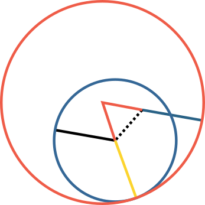

<!--
  Homepage hero — a single genuine Oliver Byrne figure (Elements of Euclid,
  1847, public domain) from Wikimedia Commons, saved in images/byrne/.
  Included from index.qmd. Purely decorative => aria-hidden.
  Subtle riso grain is applied via CSS in _byrne-includes.html.

  Block-level 
 children (not inline ) so Pandoc doesn't
  paragraph-wrap them inside the raw 
.
-->

